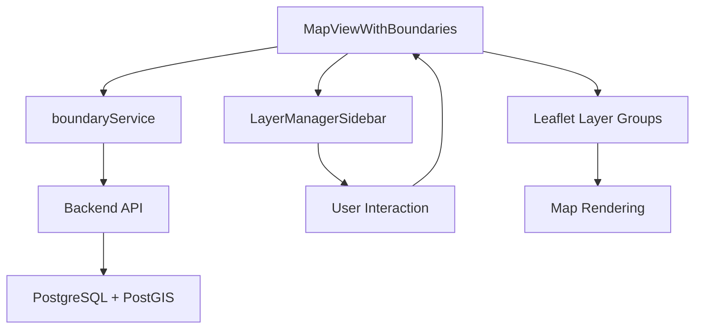

# Layer Manager Sidebar - Kullanım Kılavuzu

## 📋 Genel Bakış

BasarMapApp için modern, glassmorphism tasarımlı **Layer Manager Sidebar** (Katman Yöneticisi) oluşturuldu. Bu sidebar, GIS referans verilerini (İl Sınırları, Şehir Merkezleri, İlçe Merkezleri) harita üzerinde görselleştirmek ve yönetmek için kullanılır.

## ✨ Özellikler

### 🎨 Görsel Tasarım
- **Glassmorphism Effect**: Yarı şeffaf, backdrop-blur kullanılarak modern bir görünüm
- **Dark Theme**: Koyu tema uyumlu, harita üzerinde rahatlıkla okunabilir
- **Responsive**: Mobil ve masaüstü cihazlarda uyumlu
- **Lucide Icons**: Modern, vektör tabanlı ikonlar
- **Smooth Animations**: Hover ve transition efektleri ile akıcı kullanıcı deneyimi

### 🗺️ Katman Yönetimi

#### 1. Sınır Verileri Grubu
- **İl Sınırları (`ref_provinces`)**
  - Checkbox ile göster/gizle
  - Opacity slider ile şeffaflık ayarı (0-100%)
  - Mor renk (purple) ile görselleştirilir
  - **Not**: Bu katman sadece görsel sınırları gösterir (isim bilgisi yok)

#### 2. Yerleşim Yerleri Grubu
- **Şehir Merkezleri (BAŞKENT + İL)**
  - `kategori="BAŞKENT"` ve `kategori="İL"` olanlar
  - Kırmızı (red) marker ile gösterilir (24x24px)
  - Checkbox ve opacity slider ile kontrol edilir
  
- **İlçe Merkezleri (İLÇE)**
  - `kategori="İLÇE"` olanlar
  - Turuncu (orange) marker ile gösterilir (16x16px)
  - Daha küçük boyutlu, ilçe seviyesinde detay sağlar

### 🧭 Navigasyon Sistemi

#### Şehir Seçimi ve FlyTo
- **Searchable Dropdown**: Tüm şehirleri (BAŞKENT + İL) listeler
- **Arama Kutusu**: Türkçe karakter desteği ile canlı arama
- **FlyTo Animasyonu**: 
  - Seçilen şehre yumuşak geçiş (1.5 saniye)
  - Otomatik zoom seviyesi: 10
  - Easing: `easeLinearity: 0.25`
- **Popup Gösterimi**: Seçilen şehrin bilgilerini otomatik gösterir

## 🛠️ Teknik Detaylar

### Dosya Yapısı
```
frontend/
├── src/
│   ├── components/
│   │   ├── LayerManagerSidebar.tsx     # Sidebar komponenti
│   │   └── MapViewWithBoundaries.tsx   # Güncellenmiş harita komponenti
│   ├── services/
│   │   └── boundaryService.ts          # Boundary API servisi
│   └── index.css                       # Glassmorphism stilleri
```

### API Endpoint'leri

#### Provinces (İl Sınırları)
```typescript
GET /api/boundaries/provinces
Response: ProvinceDto[]
- id: number (ogc_fid)
- geometry: GeoJSON object
```

#### Settlements (Yerleşim Yerleri)
```typescript
GET /api/boundaries/settlements?category={category}
category: "BAŞKENT" | "İL" | "İLÇE"

Response: SettlementDto[]
- id: number (ogc_fid)
- name: string (adı)
- category: string
- geometry: GeoJSON object
- latitude: number
- longitude: number
```

### State Yönetimi

```typescript
// Layer görünürlük durumları
LayerState {
  provinceBoundaries: boolean;
  cityMarkers: boolean;
  districtMarkers: boolean;
}

// Layer şeffaflık seviyeleri
LayerOpacity {
  provinceBoundaries: number; // 0.0 - 1.0
  cityMarkers: number;
  districtMarkers: number;
}
```

### Performans Optimizasyonları

1. **useMemo**: Arama filtresi için optimize edilmiş
2. **useCallback**: Event handler'lar için memoization
3. **Lazy Loading**: Boundary verileri ilk yüklemede bir kez çekilir
4. **GeoJSON Caching**: Polygon ve marker verileri state'te saklanır
5. **Layer Groups**: Leaflet layer groups ile verimli render

## 🚀 Kullanım

### 1. Backend'i Başlatın
```bash
cd backend/BasarMapApp.Api
dotnet run
```

### 2. Frontend'i Başlatın
```bash
cd frontend
npm run dev
```

### 3. Sidebar Kullanımı

#### Katman Açma/Kapatma
1. İstediğiniz katman grubunu genişletin (Sınır Verileri veya Yerleşim Yerleri)
2. Checkbox'ı işaretleyerek katmanı aktifleştirin
3. Harita üzerinde katman otomatik olarak görünür

#### Şeffaflık Ayarlama
1. Aktif katmanın altında görünen slider'ı kullanın
2. Sol: Tamamen şeffaf (0%)
3. Sağ: Tamamen opak (100%)

#### Şehir Navigasyonu
1. "Şehir Navigasyonu" bölümündeki arama kutusuna yazın
2. Dropdown'dan istediğiniz şehri seçin
3. Harita otomatik olarak o şehre zoom yapar
4. Şehir bilgileri popup olarak gösterilir

## 🎨 Glassmorphism CSS

```css
.layer-manager-sidebar {
  background: rgba(17, 24, 39, 0.85);
  backdrop-filter: blur(12px);
  -webkit-backdrop-filter: blur(12px);
  border: 1px solid rgba(255, 255, 255, 0.1);
  border-radius: 16px;
  box-shadow: 0 8px 32px rgba(0, 0, 0, 0.4);
}
```

## 📱 Responsive Tasarım

### Desktop (>768px)
- Sol üst köşede sabit konum
- 340px genişlik
- Tam yükseklik (ekran boyutuna göre dinamik)

### Mobile (≤768px)
- Ekran genişliğine göre daralır
- Max-width: 340px
- Touch-friendly kontroller

## 🔍 Veri Akışı



## 🐛 Bilinen Sınırlamalar

1. **Province Names**: `ref_provinces` tablosunda `detay_adı` her zaman "İL_SINIRI" olduğu için isim gösterilmiyor
2. **Navigation Property Yok**: Tablolar bağımsız (foreign key yok)
3. **Bounding Box**: Henüli bbox ile filtreleme eklenmedi (opsiyonel optimizasyon)

## 📊 Performans Metrikleri

- **İlk Yükleme**: ~500ms (boundary verileri)
- **Layer Toggle**: <50ms (instant)
- **FlyTo Animation**: 1.5s (smooth)
- **Search Filter**: Real-time (useMemo ile optimize)

## 🎯 Gelecek Geliştirmeler

- [ ] District boundaries (ilçe sınırları) katmanı
- [ ] Bounding box ile dinamik veri yükleme
- [ ] Katman sıralama (drag & drop)
- [ ] Layer styling özelleştirme (renk, kalınlık)
- [ ] Export katman verileri (GeoJSON)
- [ ] Basemap seçeneği (OSM, Satellite, vb.)

## 📞 Destek

Sorularınız için:
- GitHub Issues: [proje-linki]
- Email: [email]

---

**Geliştirici Notu**: Bu sidebar, NetTopologySuite kullanılarak oluşturulan GIS Boundary API'si ile tam entegredir. SRID 4326 (WGS84) koordinat sistemi kullanılır.
